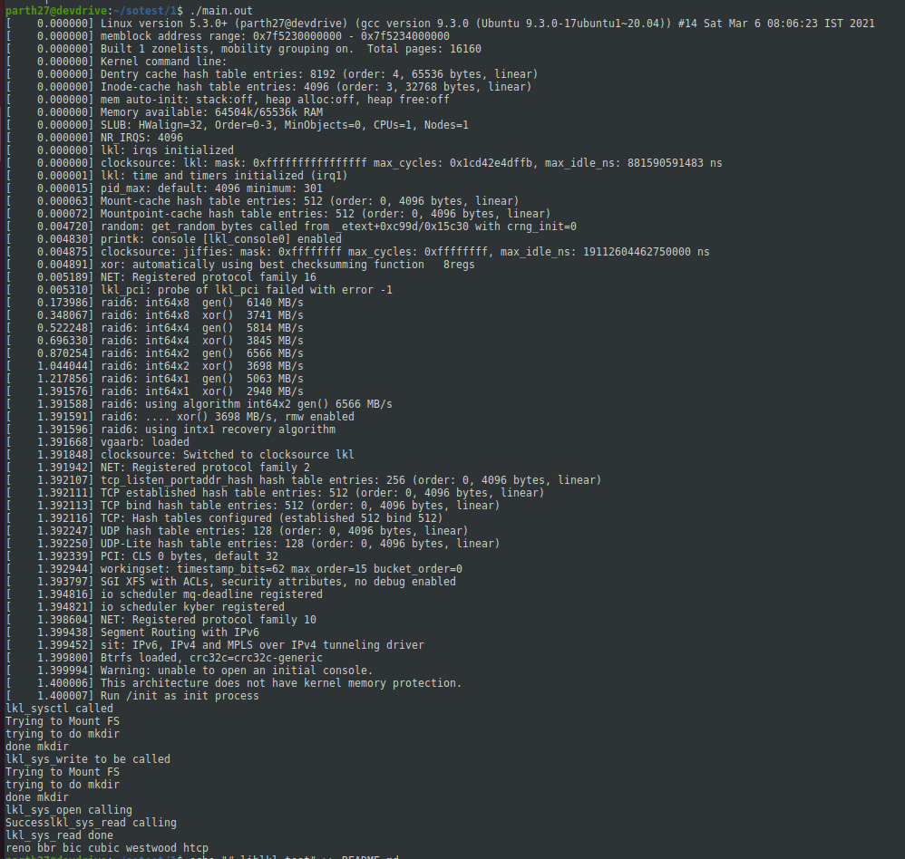

# liblkl-test

This is a sample code to emulate how liblkl.so can be setup to make use of sysctl and other functionalities.

# Build 
```
gcc -Wall -Wextra -fPIC  -rdynamic main.c -g  -I./include -I.  -L.  -lpthread -lrt -ldl -o main.out
```

# Run
```
./main.out
```

# Output

